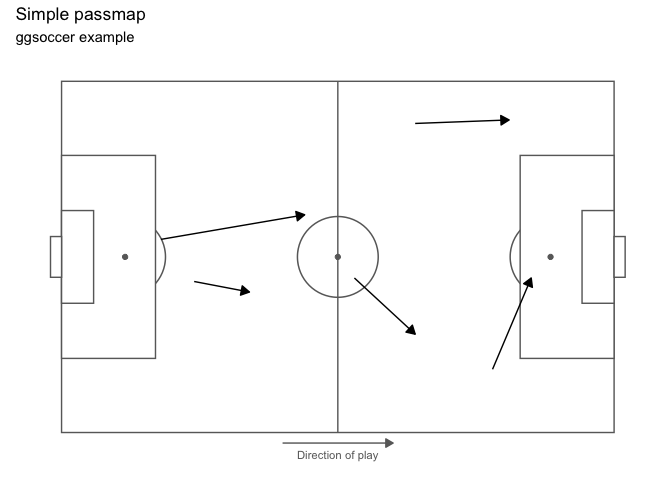
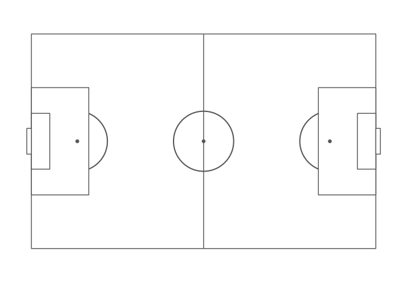

<!-- README.md is generated from README.Rmd. Please edit that file -->

# ggsoccer 

## Overview

ggsoccer provides a handful of functions to make it easy to plot
Opta-style soccer event data in R/ggplot2.

## Installation

ggsoccer is not currently available on CRAN and must be downloaded from
github like so:

``` r
# install.packages("devtools")
devtools::install_github("torvaney/ggsoccer")
```

## Usage

The following example uses ggsoccer to solve a fairly realistic problem:
plot a set of passes onto a soccer pitch.

``` r
library(ggplot2)
library(ggsoccer)

pass_data <- data.frame(x = c(24, 18, 64, 78, 53),
                        y = c(43, 55, 88, 18, 44),
                        x2 = c(34, 44, 81, 85, 64),
                        y2 = c(40, 62, 89, 44, 28))

ggplot(pass_data) +
  annotate_pitch() +
  geom_segment(aes(x = x, y = y, xend = x2, yend = y2),
               arrow = arrow(length = unit(0.25, "cm"),
                             type = "closed")) +
  theme_pitch() +
  direction_label() +
  ggtitle("Simple passmap", 
          "ggsoccer example")
```

<!-- -->

Because ggsoccer is implemented as ggplot layers, it makes customising a
plot very easy. Here is a different example, plotting shots on a
**green** pitch.

Note that by default, ggsoccer will display the whole pitch. To display
a subsection of the pitch, simply set the plot limits as you would with
any other ggplot2 plot. Here, we use the `xlim` and `ylim` arguments to
`coord_flip`.

Because of the way coordinates get flipped, we must also reverse the
y-axis to ensure that the orientation remains correct.

NOTE: Ordinarily, we would just do this with `scale_y_reverse`. However,
due to a [bug in
ggplot2](https://github.com/tidyverse/ggplot2/issues/3120), this results
in certain elements of the pitch (center and penalty box arcs) failing
to render. Instead, we can flip the y coordinates manually (`100 - y` in
this case).

``` r

shots <- data.frame(x = c(90, 85, 82, 78, 83, 74, 94, 91),
                    y = c(43, 40, 52, 56, 44, 71, 60, 54))

ggplot(shots) +
  annotate_pitch(colour = "white",
                 fill   = "chartreuse4",
                 limits = FALSE) +
  geom_point(aes(x = x, y = 100 - y),
             colour = "yellow", 
             size = 4) +
  theme_pitch() +
  theme(plot.background = element_rect(fill = "chartreuse4"),
        title = element_text(colour = "white")) +
  coord_flip(xlim = c(49, 101),
             ylim = c(-1, 101)) +
  ggtitle("Simple shotmap",
          "ggsoccer example")
```

<!-- -->

### Data providers

ggsoccer defaults to Opta’s 100x100 coordinate system. However,
different data providers may use alternative coordinates.

ggsoccer provides support for a couple of data providers out of the box,
as well as an interface for custom coordinates.

#### Statsbomb

``` r
# Hackily rescale shots to use StatsBomb-style coordinates
passes_rescaled <- data.frame(x  = pass_data$x * 1.20,
                              y  = pass_data$y * 0.80,
                              x2 = pass_data$x2 * 1.20,
                              y2 = pass_data$y2 * 0.80)

ggplot(passes_rescaled) +
  annotate_pitch(dimensions = pitch_statsbomb) +
  geom_segment(aes(x = x, y = y, xend = x2, yend = y2),
               colour = "firebrick",
               arrow = arrow(length = unit(0.25, "cm"),
                             type = "closed")) +
  theme_pitch() +
  direction_label(x_label = 60) +
  ggtitle("Simple passmap", 
          "Statsbomb co-ordinates")
```

<!-- -->

#### Custom data

To plot data for a dataset not provided is also possible. ggsoccer just
requires a pitch specification. This is a list containing the required
pitch dimensions:

``` r
pitch_custom <- list(
  length = 150,
  width = 100,
  penalty_box_length = 25,
  penalty_box_width = 50,
  six_yard_box_length = 8,
  six_yard_box_width = 26,
  penalty_spot_distance = 20,
  goal_width = 12,
  origin_x = 0,
  origin_y = 0
)
```

This can then be used to generate pitch markings:

``` r
ggplot() +
  annotate_pitch(dimensions = pitch_custom) +
  theme_pitch()
```

<!-- -->

## Other options

There are other packages that offer alternative pitch plotting options.
Depending on your use case, you may want to check these out too:

  - [soccermatics](https://github.com/JoGall/soccermatics)
  - [SBpitch](https://github.com/FCrSTATS/SBpitch)
